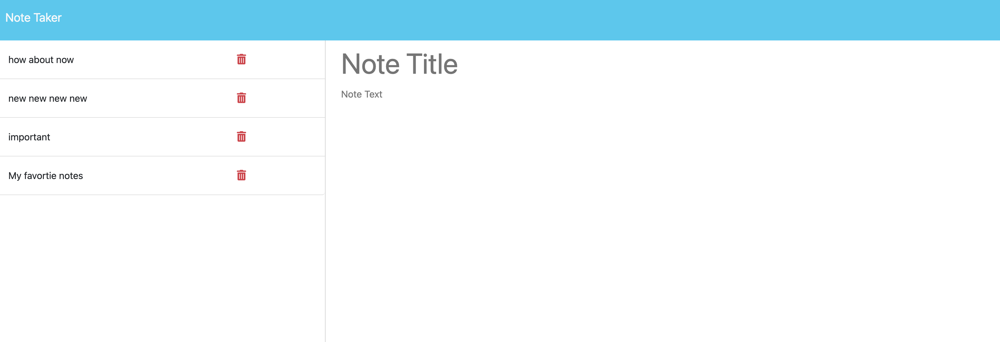
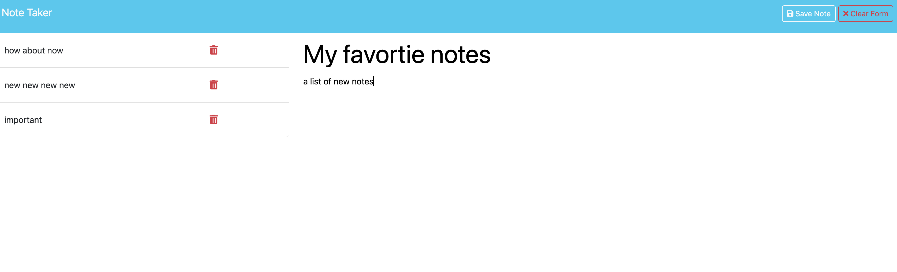

# Note Taker


## Description
	I wanted to have an online notes app. I need it to have a title and a short description. Additionally when I don't need the note anymore, it can be deleted. 

## Table of Contents

- [Installation](#installation)
- [Usage](#usage)
- [Credits](#credits)
- [License](#license)


## Installation
No install necessary, go to this [link](https://pacific-refuge-26136-1c23ae8b2af2.herokuapp.com/), or copy the url in your browser https://pacific-refuge-26136-1c23ae8b2af2.herokuapp.com/.


## Usage
    1. Get by clicking the "Get Started" button. Then you will see a form where you're able to put your Note title and text.


    2. Once you added the title and text, then you can save your note at the top right corner.


    3. Lastly you can delete note by clicking the red trash icon.


## Credits

Michael Nguyen


## License
```
MIT License

Copyright (c) [2024] [Michael Nguyen]

Permission is hereby granted, free of charge, to any person obtaining a copy
of this software and associated documentation files (the "Software"), to deal
in the Software without restriction, including without limitation the rights
to use, copy, modify, merge, publish, distribute, sublicense, and/or sell
copies of the Software, and to permit persons to whom the Software is
furnished to do so, subject to the following conditions:

The above copyright notice and this permission notice shall be included in all
copies or substantial portions of the Software.

THE SOFTWARE IS PROVIDED "AS IS", WITHOUT WARRANTY OF ANY KIND, EXPRESS OR
IMPLIED, INCLUDING BUT NOT LIMITED TO THE WARRANTIES OF MERCHANTABILITY,
FITNESS FOR A PARTICULAR PURPOSE AND NONINFRINGEMENT. IN NO EVENT SHALL THE
AUTHORS OR COPYRIGHT HOLDERS BE LIABLE FOR ANY CLAIM, DAMAGES OR OTHER
LIABILITY, WHETHER IN AN ACTION OF CONTRACT, TORT OR OTHERWISE, ARISING FROM,
OUT OF OR IN CONNECTION WITH THE SOFTWARE OR THE USE OR OTHER DEALINGS IN THE
SOFTWARE.
```